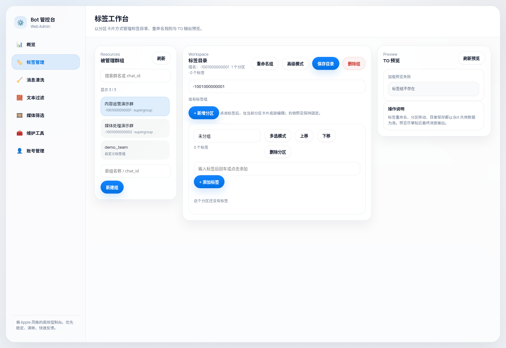
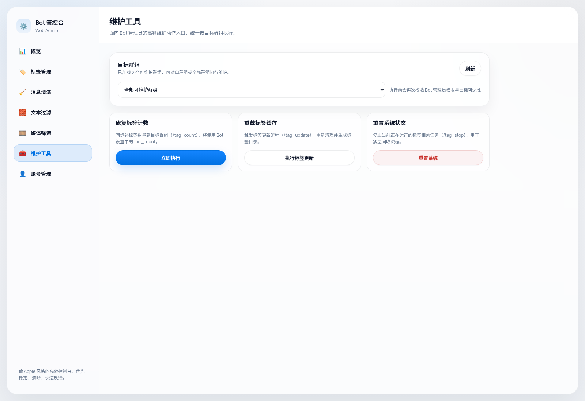
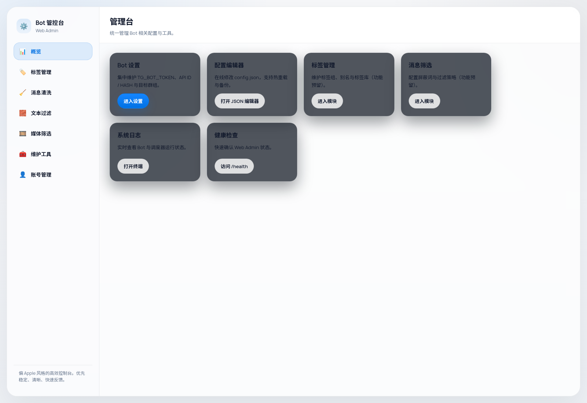

# Channel Manager Bot



[](https://hub.docker.com/r/leduchuong/telegram_mediachanel_manager_bot)
[](https://github.com/leduchuong48-byte/telegram_chanel_manager_bot/stargazers)
[](https://github.com/leduchuong48-byte/telegram_chanel_manager_bot/network/members)
[](https://github.com/leduchuong48-byte/telegram_chanel_manager_bot/issues)
[](https://github.com/leduchuong48-byte/telegram_chanel_manager_bot/blob/main/LICENSE)
[](#)

[English](README_en.md)

> 面向 Telegram 群组与频道维护场景的自托管 Bot + Web Admin 工作台，重点提升标签管理效率、工具页一致性与长期维护体验。

## Why this tool?

很多 Telegram 运维工具都能“完成任务”，但很难把高频维护动作真正做顺手：标签管理像在修文本文件，工具页风格互不一致，改完规则以后还要反复猜测 Bot 最终会输出什么。Channel Manager Bot 想解决的不是某一个孤立功能，而是把日常维护里最常见、最反复、最容易出错的那一整条工作流，整理成一个更稳定、更直观、更适合长期使用的后台系统。

## 3.5 版本重点

- **Web Admin 前端体验升级**：后台页面按两种模式重构，标签工作台用于持续编辑与预览，工具页用于配置、维护和执行类操作，整体页面结构、按钮样式、提示反馈、滚动规则与视觉层级都更统一。
- **标签工作台真正可用**：标签管理从旧文本编辑方式升级为分区工作台，左侧显示被管理群组，中间编辑标签目录，右侧固定 TG 预览；点击标签后可直接在当前分区中编辑，不再依赖不稳定浮层。
- **标签操作工作流增强**：支持单标签重命名规则、多选模式、多标签合并到同一目标标签、分区内新增标签、分区排序、标签移动到其他分区，以及新建分区并移动。
- **Bot 联动一致性增强**：Web Admin 与 Bot 命令继续共用同一套标签文件和 alias 规则，TG 预览尽量贴近 Bot 实际输出，减少“改完靠猜”的情况。
- **目标群组选择统一**：`tags`、`cleaner`、`media_filter`、`tools` 页面统一只显示 `bot_can_manage == true` 的目标，降低误操作概率。
- **可用性修复**：修复 `/account` 404，提升屏蔽词列表可读性，修复 tags 页面多处脚本与交互反馈问题，并减少大分区场景下的来回滚动。

## Web Admin UI Preview

### 标签工作台


新的标签工作台把“目标群组、标签分区、TG 预览”放进同一个编辑视图里，适合持续整理标签目录、重命名规则和分区结构，而不是像过去那样在多个零碎状态之间跳来跳去。

### 工具页



工具页强调统一的节奏：先选目标群组，再执行维护动作，再看反馈。消息清洗、媒体筛选、维护工具等页面不再各说各话。

### 入口与总览



主页负责把高频入口和维护方向清楚地收拢起来，让配置编辑、Bot 设置、标签管理和日志查看都有稳定的落点。

## 核心能力

- **标签工作流**：标签分区、别名规则、预览、排序、移动、批量整理。
- **维护工具**：清洗、筛选、维护动作统一成一致的工具页交互。
- **Bot / Web 共用规则**：前台编辑和 Bot 执行使用同一套标签与 alias 文件，减少前后台不一致。
- **自托管友好**：适合 Docker / Compose / NAS 场景，运行依赖清晰，数据目录独立。

## ⚡ Quick Start

```bash
docker run -d \
  --name telegram_mediachanel_manager_bot \
  --restart unless-stopped \
  -p 1009:8000 \
  -v /path/to/data:/app/data \
  -v /path/to/sessions:/app/sessions \
  leduchuong/telegram_mediachanel_manager_bot:latest
```

## Docker Compose

```yaml
services:
  app:
    image: leduchuong/telegram_mediachanel_manager_bot:latest
    container_name: telegram_mediachanel_manager_bot
    restart: unless-stopped
    ports:
      - "1009:8000"
    environment:
      - TZ=Asia/Shanghai
      - LOG_LEVEL=INFO
    volumes:
      - ./data:/app/data
      - ./sessions:/app/sessions
```

## 使用建议

- 标签整理优先在 `/tags` 中完成，原始文本模式更适合作为兼容或高级入口。
- 对复杂标签整理任务，优先使用单标签编辑、多选模式和 TG 预览配合工作。
- 生产环境请始终把 token、session、群组数据和运行数据库留在外部挂载目录，不要进入仓库或镜像层。

## 项目结构

- `app/`：FastAPI Web Admin
- `tg_media_dedupe_bot/`：Bot 核心逻辑
- `scripts/`：维护与自检脚本
- `WEB_ADMIN_README.md`：偏操作手册的 Web Admin 说明

## 在哪里获得帮助

- Issues: https://github.com/leduchuong48-byte/telegram_chanel_manager_bot/issues
- Discussions: https://github.com/leduchuong48-byte/telegram_chanel_manager_bot/discussions
- Docker Hub: https://hub.docker.com/r/leduchuong/telegram_mediachanel_manager_bot

## 免责声明

使用本项目即表示你已阅读并同意 [免责声明](DISCLAIMER.md)。

## 许可证

MIT，详见 [LICENSE](LICENSE)
