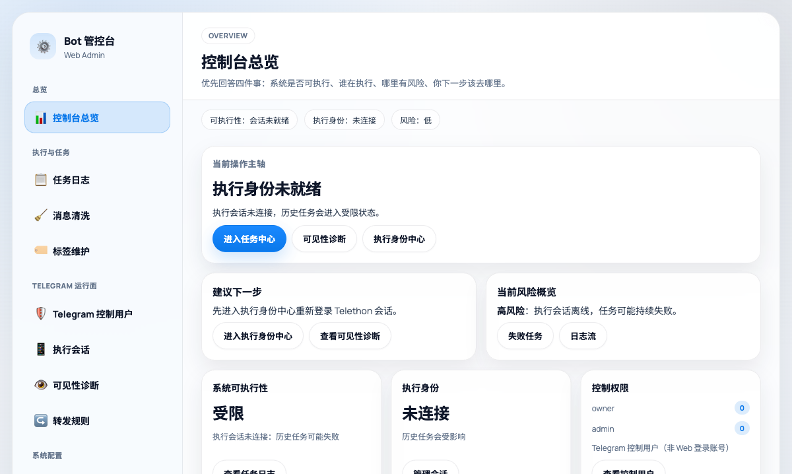
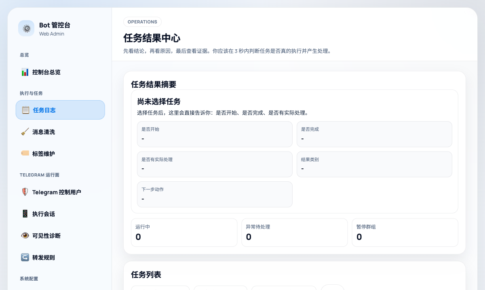
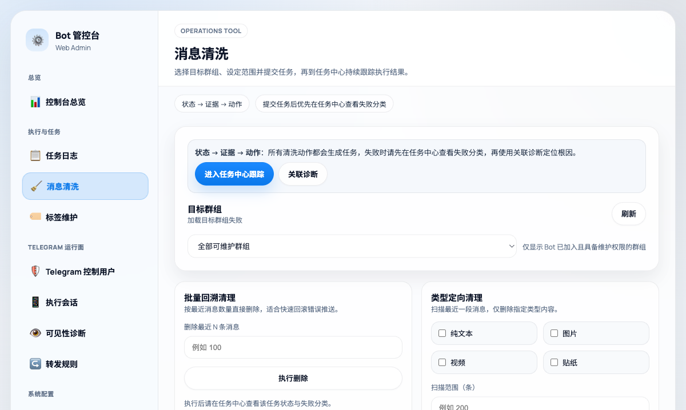
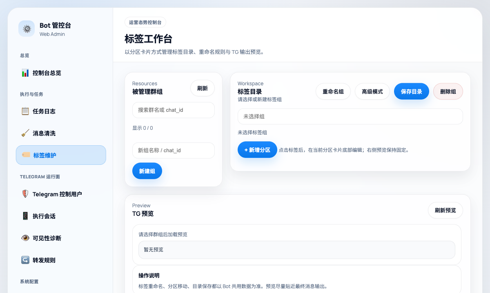
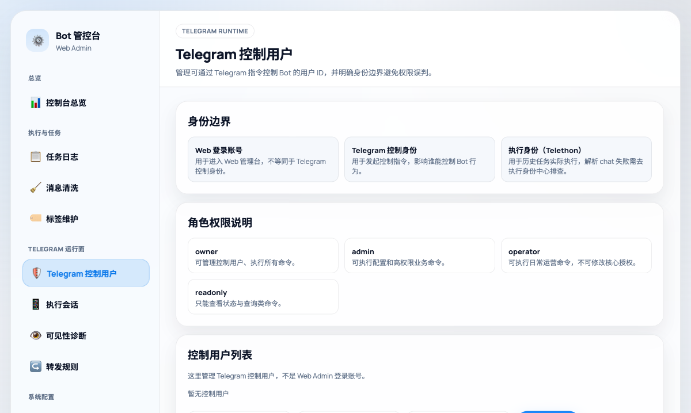

# Telegram Channel Manager Bot



[](https://hub.docker.com/r/leduchuong/telegram_mediachanel_manager_bot)
[](https://github.com/leduchuong48-byte/telegram_chanel_manager_bot/stargazers)
[](https://github.com/leduchuong48-byte/telegram_chanel_manager_bot/network/members)
[](https://github.com/leduchuong48-byte/telegram_chanel_manager_bot/issues)
[](https://github.com/leduchuong48-byte/telegram_chanel_manager_bot/blob/main/LICENSE)
[](#)
[](#)

[English](README_en.md)

> Better alternative to legacy admin bot panel for E-ink devices.

Telegram Channel Manager Bot 是一个面向 Telegram 群组/频道运营管理的自托管后台，集成媒体去重、消息清洗、标签维护、控制用户管理和 Web Admin 控制台，适合需要长期维护频道内容与运营任务的场景。

## Why this tool?（为什么要做它）

`3.5` 已具备管理能力，但随着 Cleaner、标签维护、任务跟踪和控制权限需求增长，旧版后台入口和信息层级逐渐分散。`4.0` 的核心是重做控制台信息架构，让运营侧能更快判断系统状态、更快发起动作、更快定位问题。

## 4.0 相比 3.5 的大版本升级

- 全新控制台总览：以“状态 -> 风险 -> 下一步动作”的路径组织信息。
- 新任务结果中心：先看结论，再看原因，再看证据，减少排障往返。
- Cleaner / Tools / Tags 工作流统一：高频维护动作有一致的操作路径。
- 身份边界更清晰：Web 登录账号、Telegram 控制用户、执行会话明确拆分。
- 标签工作台重构：更适合持续维护和多人协作。

## UI 预览（4.0 新版）







## ⚡️ Quick Start (Run in 3 seconds)

```bash
docker run -d --name telegram_mediachanel_manager_bot --restart unless-stopped -p 1009:8000 --env-file .env -v $(pwd)/config.json:/app/config.json -v $(pwd)/data:/app/data -v $(pwd)/sessions:/app/sessions -v $(pwd)/backups:/app/backups leduchuong/telegram_mediachanel_manager_bot:latest
```

## Docker Compose（Portainer / NAS 可直接粘贴）

Copy this into Portainer stacks and hit Deploy. Done.

```yaml
services:
  telegram_mediachanel_manager_bot:
    image: leduchuong/telegram_mediachanel_manager_bot:latest
    container_name: telegram_mediachanel_manager_bot
    restart: unless-stopped
    ports:
      - "1009:8000"
    env_file:
      - .env
    volumes:
      - ./config.json:/app/config.json
      - ./data:/app/data
      - ./sessions:/app/sessions
      - ./backups:/app/backups
```

## Why upgrade to 4.0

如果你仍在使用 `3.5`，建议升级到 `4.0`。新版价值不只是视觉变化，而是后台操作路径、任务诊断链路和权限边界都更清晰，能显著降低维护和排障成本。

## 在哪里获得帮助

- Issues: https://github.com/leduchuong48-byte/telegram_chanel_manager_bot/issues

## 免责声明

使用本项目即表示你已阅读并同意 [DISCLAIMER.md](DISCLAIMER.md)。
